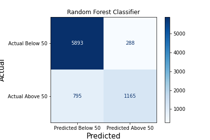

# Random Forest Classification with US Census Data

- [Problem Statement](#Problem-Statement)
- [Exploratory Data Analysis and Feature Engineering](#Exploratory-Data-Analysis-and-Feature-Engineering)
- [Data Dictionary](#Data-Dictionary)
- [Model Performance on Training and Test Data](#Model-Performance-on-Training-and-Test-Data)
- [Primary Findings](#Primary-Findings)
- [Next Steps](#Next-Steps)

## Overview

This project was completed for a hackathon. Each team was requried to select one of the following constraints to work with:  

### Team Sample Constraint
- Your choice of algorithm
- Your choice of features
- **Must use the cheap train sample**

### Team Features Constraint
- Your choice of algorithm
- **Limited to a maximum of 20 features**
- Your choice of samples

### Team Algorithm Constraint
- **Must use a Random Forest**
- Your choice of features
- Your choice of samples

Our team understood that when a dataset is truly known, and handled correctly, the selection of the actual model becomes less important. Even complicated datasets can be well represented by linear regression so long as the data scitists working on them have prepared them appropriately.  With this in mind, the team decided to select the model constraint.   
    

## Problem Statement

Our goal is to build a random forest model that will accurately predict whether or not a person earns a salary of more than \$50,000 based on a number of their personal, demographic, and financial characteristics.

Given a  dataset of features from the 1994 US Census, we are going to find and create the most meaningful features to give our random forest model the best chance at predicting which group a person belongs to.

## [Data Dictionary](https://archive.ics.uci.edu/ml/datasets/adult)

| **Variable**   | **Description**                                         |
|----------------|---------------------------------------------------------|
| age            | Age, in years of person                                 |
| workclass      | Type of agency of occupation                            |
| fnlwgt         | Final weight                                            |
| education      | Highest level of education completed                    |
| education-num  | Numerical mapping of highest education completed        |
| marital-status | Maritial status of an individual, and to type of person |
| occupation     | Type of work individual                                 |
| relationship   | Type of relationship                                    |   
| sex            | Biological sex, male or female                          |
| capital-gain   | Capital gains earned that year                          |
| capital-loss   | Capital losses that year                                |
| hours-per-week | Hours worked per weak                                   |
| native-country | Country of origin                                       |
| wage           | Whether or not a person earned $50,000                  |

## Exploratory Data Analysis and Feature Engineering

With a firm understanding of what was offered in our data, we read it in and began the cleaning process. We noticed that there were no instances of missing data. Additionally, the type of data in each column was exactly as we expected  and hoped (no objects or strings where we expected numerical values and vice versa). 

We spent time creating visualizations to better understand the grouping and occurrences of data points, and created a correlation matrix to further visualize the relationship between numerical features in our data set.

Relying solely on Random Forest Classification, we needed to train the model on a richer feature set than provided. Knowing that any capital gain or loss indicated that the individual had enough income to invest, we created a column called ‘In Market’. We also created features for those who worked less than and more than 40 hours per week, leaving out those who worked exactly 40 as unextraordinary. We eventually needed a column for those who had capital gains more than \$5,000.

Each successive decade from ‘Over 20’ to Over 70’ received its own feature column because we saw a linear relationship between Age and income. We also found a relationship between marriage and earning, reflected in the new feature, ‘Has Spouse’.
               
The column titled ‘native-country’ from the original training dataset did not provide us with a clear picture of the effect country of origin has on one’s earnings. The overwhelming majority of entries in that column were ‘USA’ so we created a new column based on whether the individual is an immigrant on not. Going deeper, we broke country of origin down into two piles of countries based on their correlation to higher earnings.

Finally, we found a clear separation between those who had a bachelor’s degree or higher, and those who did not. This new feature is called ‘Higher Ed’.

## Model Performance on Training and Test Data

The first thing determined to benchmark our model performance was the baseline accuracy. This was established to be 75.9%.

As the model we are using is constrained to the [Random Forest Classifier](https://scikit-learn.org/stable/modules/generated/sklearn.ensemble.RandomForestClassifier.html) and our features have been engineered, the next part of the process involved selecting the hyper parameters. A grid search with cross validation was used to find the best performing hyper parameters.The following options were of note:

- Out of Bag Samples:
    - Sent the samples that didn't match when picking a branch to the next iteration.

- Max Features of 75: 
    - Some features were dropped as not contributing to higher accuracy.
    
    
- Warm Start: 
    - Existing fitted attributes are used during the next fit.
    
    
- Entropy used to split:
    - Guages the disorder using a logarithm based metric.
    
    
- Cost-Complexity Pruning Alpha of 0.001:
    - Helped to avoid initial overfitting.
    
    
- Max Samples of 0.3: 
    - 30\% of the data was used as the max bootstrap sample size and gave a small increase in performance.

## Primary Findings

We were able to beat the baseline accuracy of 75.9\% with an accuracy of 86.7\% on our test data.We had about three times more false negatives than false positives. We discovered in the confusion matrix that most cases of misclassification were occuring when an individual acutally earned more than \\$50,000 but was classified as under \\$50,000. 

Looking into this set of misclassified individuals revealed that these were mainly of individuals classified as married with a civilian and with capital gains below 200 (raw value). About 75\% of all those misclassified as below \$50,000 when they were below fall into this category.

## Next Steps

Our next steps would be to dive deeper into feature engineering and looks for more effective features to determine if an individual earns more that \$50,000 a year.

Knowing what we do about our misclassifications we can also look to acquire more data about these individuals that sets them apart.# project4
